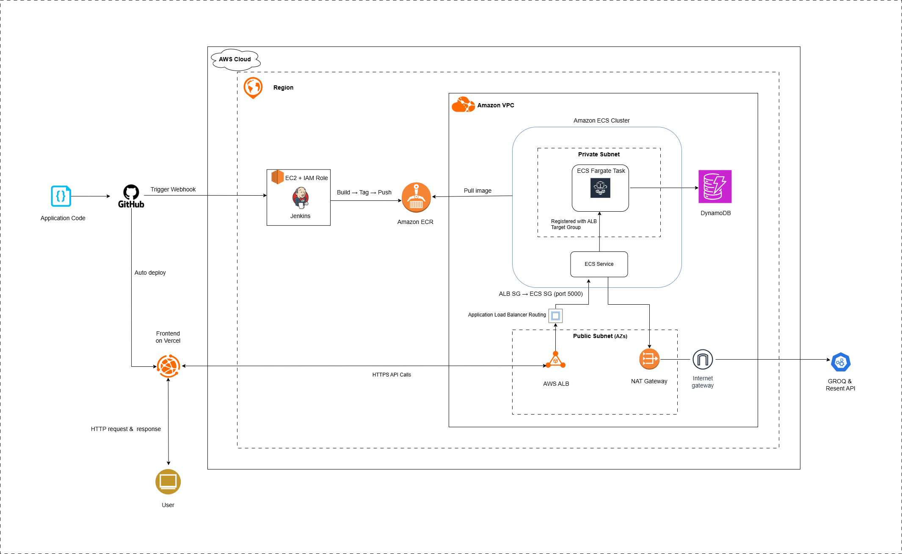
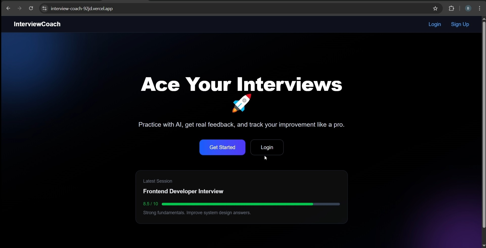
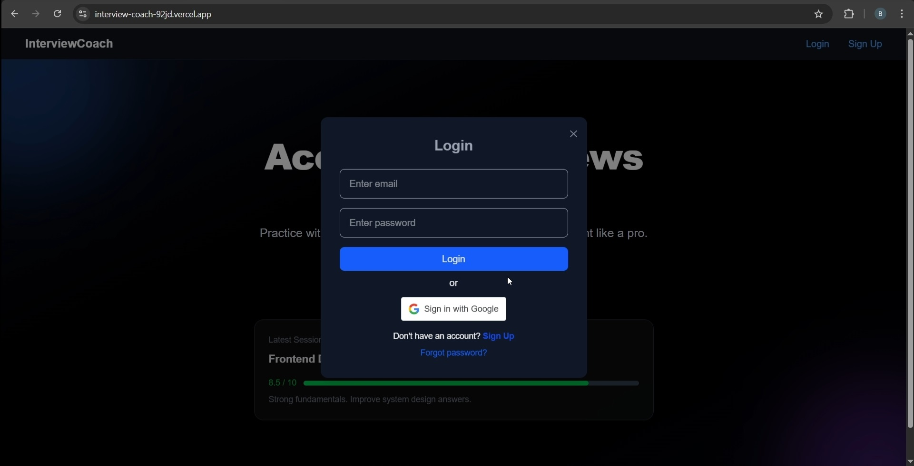
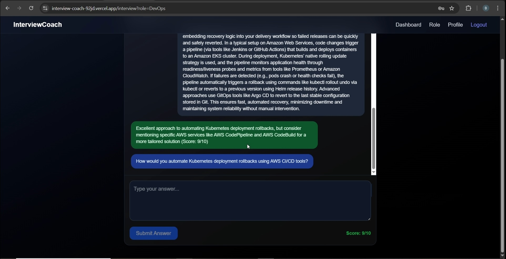
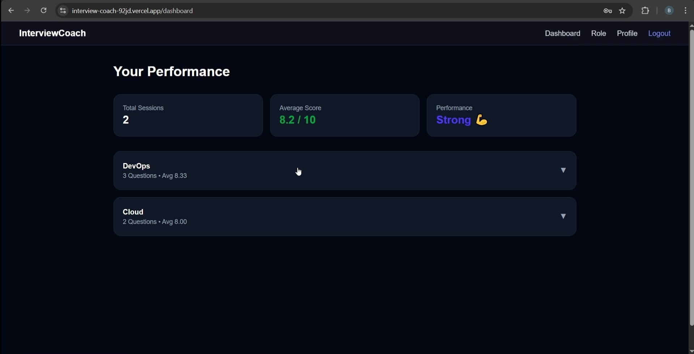
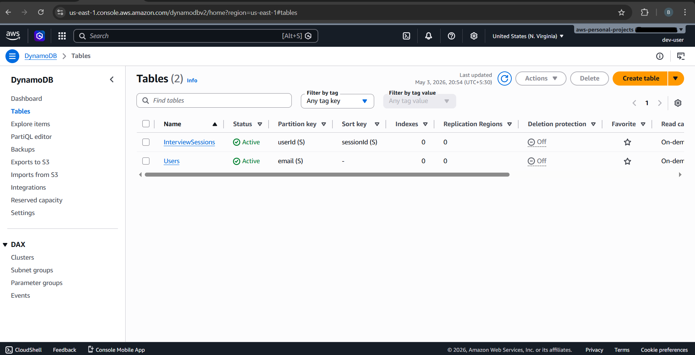
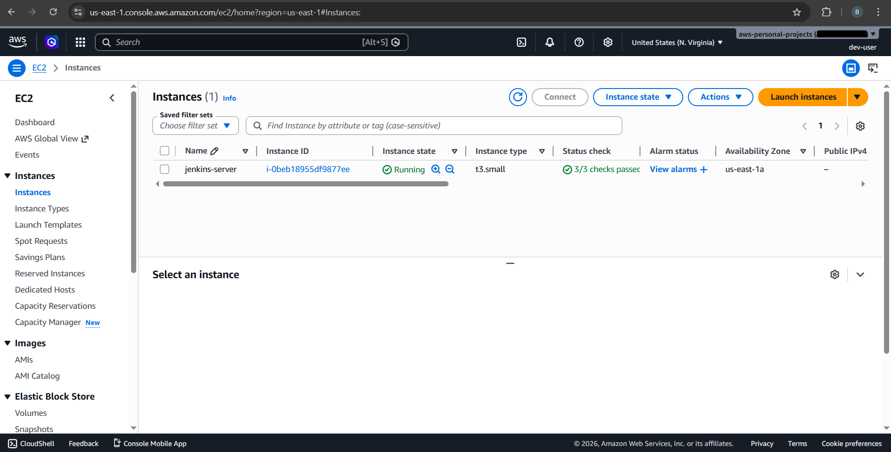
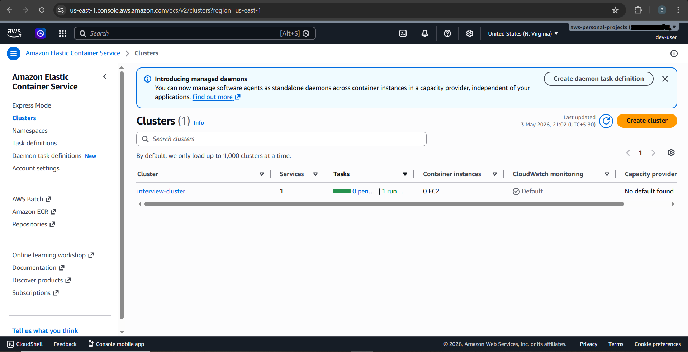
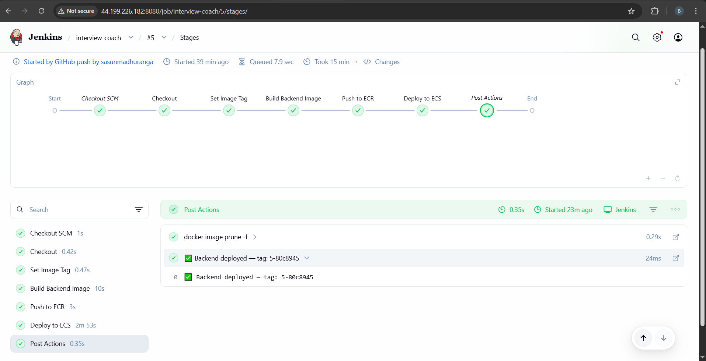

# AI Interview Coach

An AI-powered interview preparation platform. Practice technical interviews, get real-time feedback, and track your progress — all backed by a production-grade AWS infrastructure.

---

## What It Does

- Generates role-specific interview questions via Groq LLM
- Evaluates answers and provides AI-generated scores and feedback
- Tracks interview session history and performance over time
- Supports JWT and Google OAuth authentication
- Sends password reset emails via Resend

---

## Tech Stack

**Frontend** — Next.js, TypeScript, Tailwind CSS, deployed on Vercel

**Backend** — Node.js, Express.js, TypeScript, Dockerized, deployed on Amazon ECS Fargate

**Database** — Amazon DynamoDB (pay-per-request)

**AI** — Groq LLM API

**Infrastructure** — Terraform, AWS (ECS, ECR, VPC, ALB, DynamoDB, SSM, CloudWatch, IAM)

**CI/CD** — Jenkins, Docker, GitHub Webhooks

---

## Architecture

<p align="center">
    
</p>

**VPC:** `10.0.0.0/16`, Multi-AZ (`us-east-1a`, `us-east-1b`)

- ECS tasks run in private subnets — not publicly accessible
- ALB is the only public-facing component
- Security groups restrict ECS inbound traffic to ALB only
- Outbound access via NAT Gateway

---

## CI/CD Pipeline

```
GitHub → Jenkins → Docker Build → ECR → ECS Rolling Deploy
```

- Triggered automatically via GitHub webhooks
- Docker image tagged with `BUILD_NUMBER` and Git commit SHA
- ECS service waits for stability before pipeline completes
- Stale Docker images cleaned up post-deploy

Frontend deploys automatically via Vercel on push to main.

---

## Secrets Management

All sensitive values are stored in **AWS SSM Parameter Store** as `SecureString`:

- JWT secret
- Groq API key
- Resend API key
- Google OAuth credentials

IAM roles follow least-privilege access — separate roles for ECS task execution, ECS task runtime, and Jenkins EC2.

---

## Infrastructure (Terraform)

Resources provisioned via Terraform in `infrastructure/`:

| Resource | Details |
|---|---|
| VPC + Subnets | Multi-AZ, public + private |
| ECS Cluster + Service | Fargate launch type |
| Application Load Balancer | HTTPS termination, health checks |
| ECR Repository | Docker image registry |
| DynamoDB Tables | PAY_PER_REQUEST billing |
| IAM Roles | Task execution, task runtime, Jenkins |
| SSM Parameters | Encrypted secrets |
| CloudWatch Log Groups | Centralized logging |
| NAT + Internet Gateway | Outbound + inbound routing |

---

## Project Structure

```
project-root/
├── frontend/           # Next.js app
├── backend/            # Express.js API
├── terraform/     
│   ├── main.tf
│   ├── provider.tf
│   ├── variables.tf
│   └── outputs.tf
├── Jenkinsfile         # CI/CD pipeline
└── README.md
```

---

## Getting Started

### Prerequisites

- Node.js 18+
- Docker
- Terraform
- AWS CLI (configured)
- Jenkins (for CI/CD)

### Local Development

```bash
# Backend
cd backend
npm install
npm run dev

# Frontend
cd frontend
npm install
npm run dev
```

### Infrastructure

```bash
cd infrastructure
terraform init
terraform plan
terraform apply
```

Secrets must be manually created in SSM before deploying ECS tasks.

---

## Roadmap

- [ ] HTTPS with ACM + Route53 custom domain
- [ ] ECS Auto Scaling based on CPU/memory
- [ ] Redis caching layer
- [ ] Blue/Green deployments
- [ ] Grafana monitoring dashboards
- [ ] AI analytics dashboard
- [ ] EKS migration (Kubernetes)

---
## 📸 Screenshots
<p align="center">
    
    
    
    
    
    
    
    
</p>

---

## Author
Sasun Madhuranga

GitHub: https://github.com/sasunmadhuranga

